# Procuce Bargain

Pruduce Bargain is a product of 12 weeks of intensive BackEnd and FrontEnd training received while attending Java Web Develeopment cohort in Boston offered by [Platfrom by perscholas](https://perscholas.org/partner/platform-by-per-scholas)

My Project focus on attention to food waste in America and offers a solution to help reduce food waste while improving assibility to healthy food options , especially to those in need.

# UseCaseDB

This project uses MariaDB as the datasource of choice. 
README_INFO/UserCaseDB_inserts.sql will create the database, tables, and poulate with sample data to get you started.

My Java-EE applicaiton uses Java Persistence API (JPA) interface in conjunction with EclipseLink for ORM (Object Relational Mapping) and to manage my relational data so that I can map, store, update and retrieve data from relational databases (MariaDB) to and from my Java objects. 

Database connection configurations can be found and updated within Java resources META-INF/persistence.xml 

# Project Slide Deck

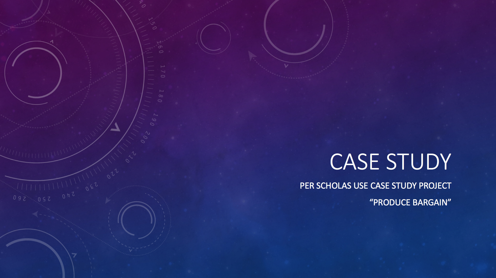

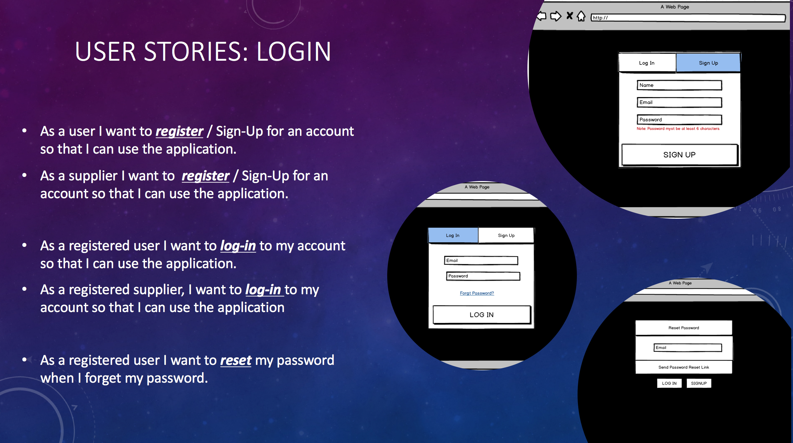
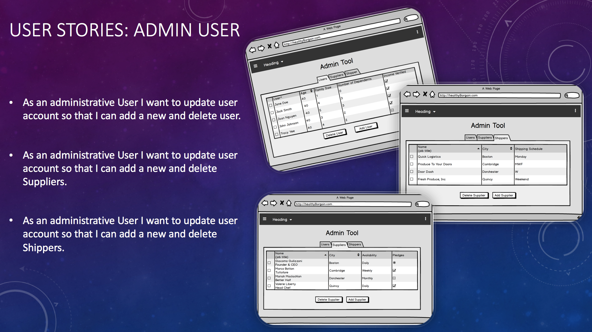
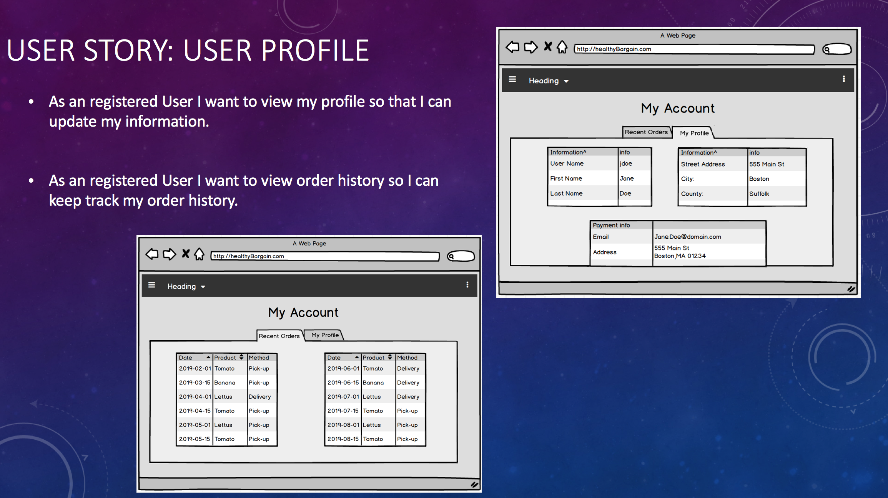
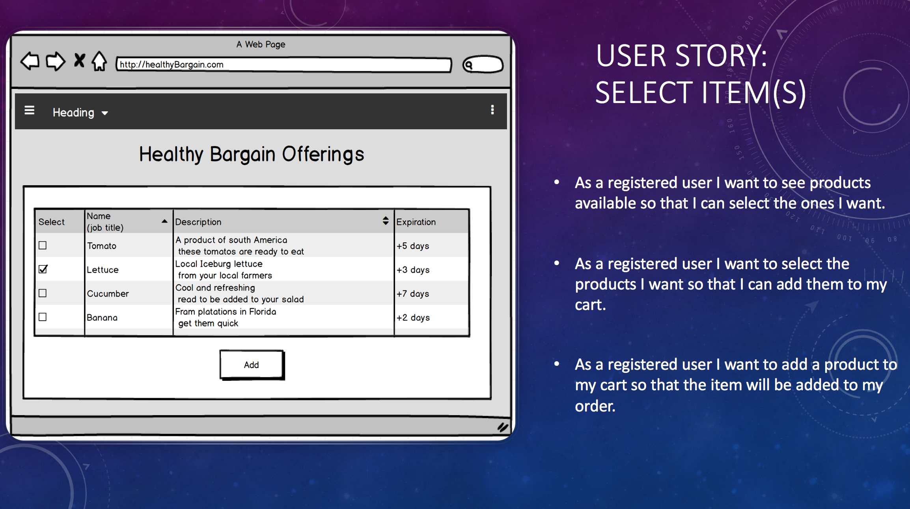
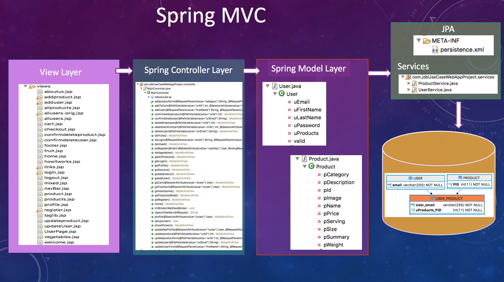
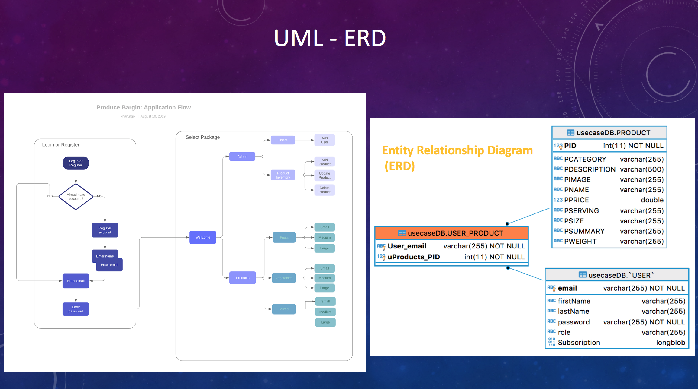
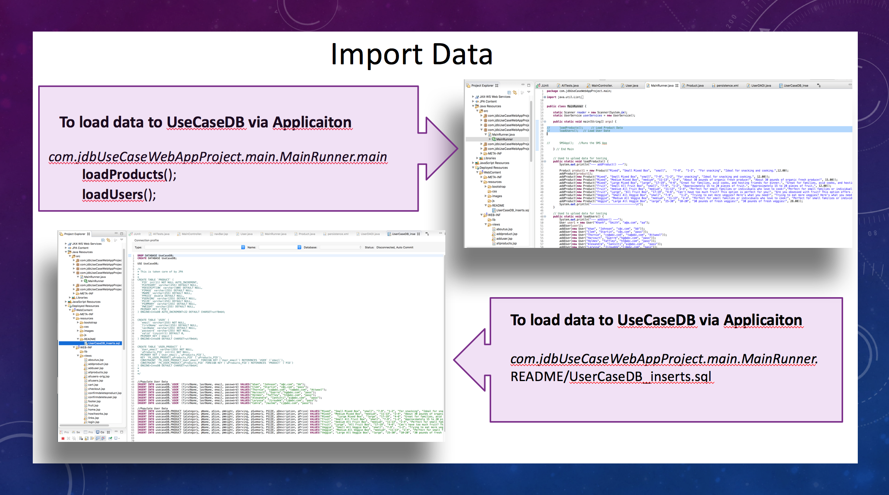
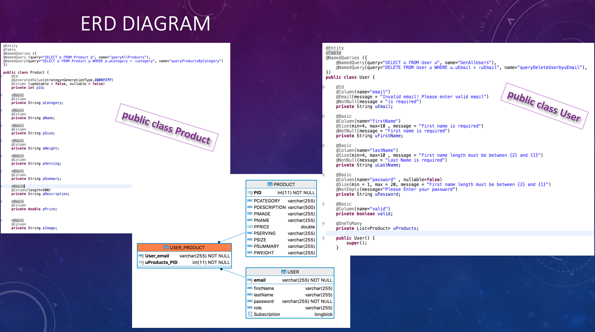
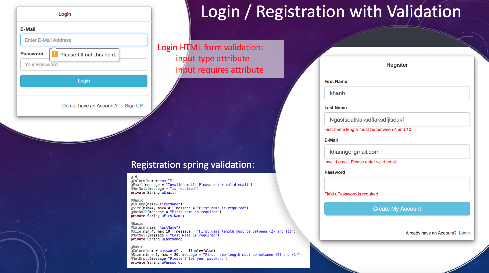
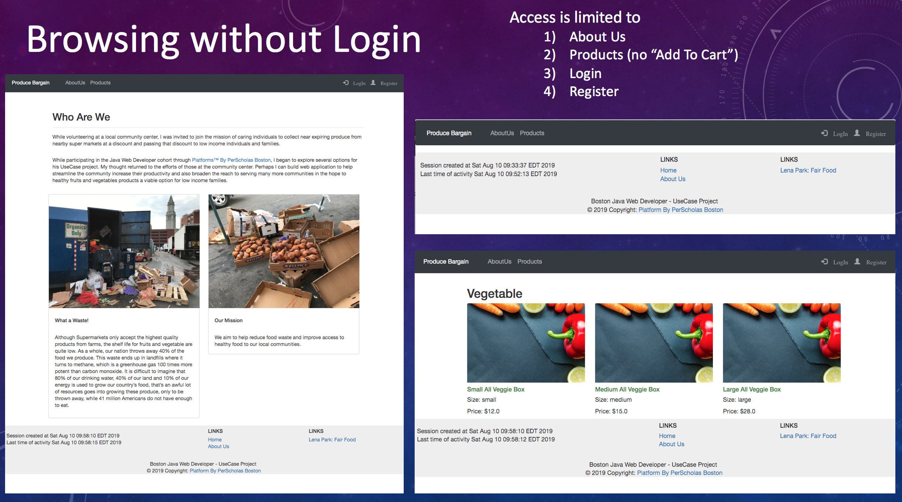
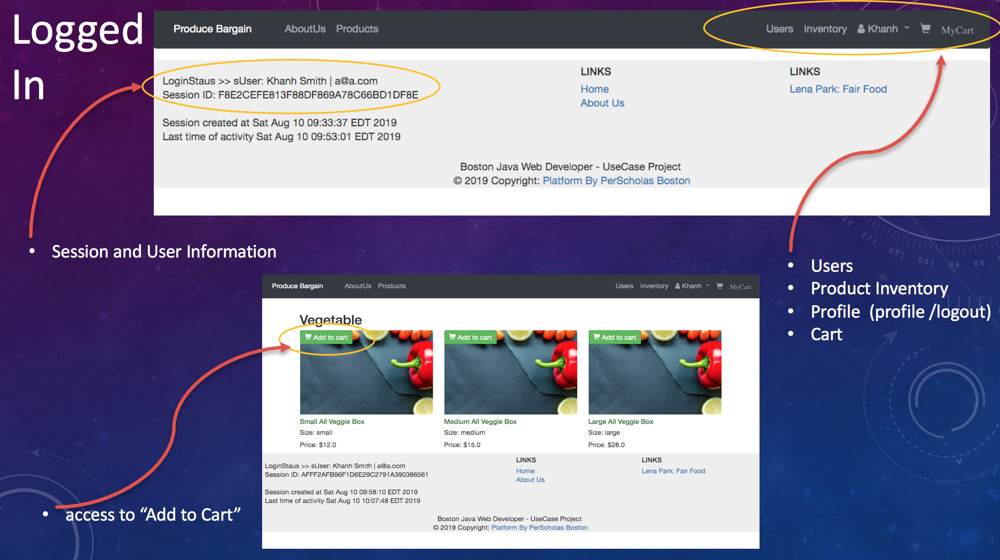
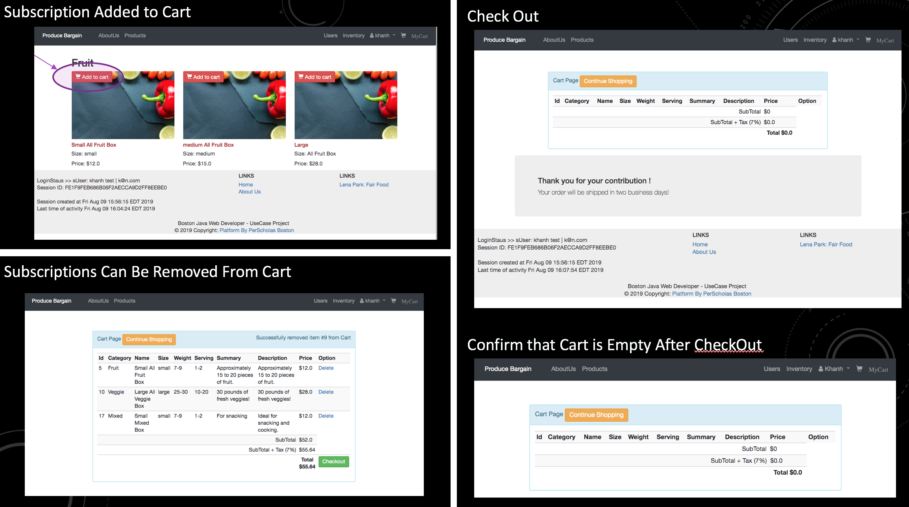
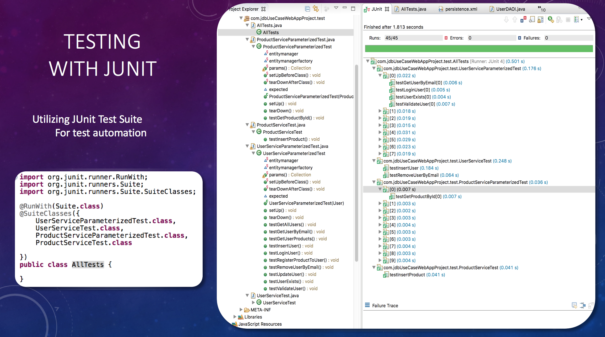
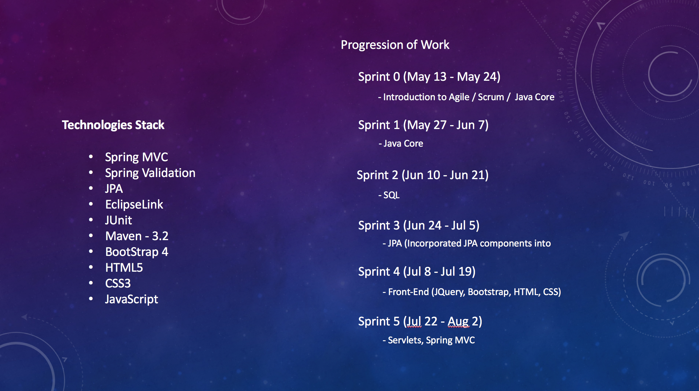

