# Welcome to Procuce Bargain

"Produce Bargain" utilizes technology stack and skills gained while attending Boston Full Stack Java Web Developer cohort offered by [Platform by Per Scholas](https://perscholas.org/partner/platform-by-per-scholas)

This app  aims to provide a solution to reduce food waste and increase accessibility to affordable produce to local communities, providing produce at a bargain.

## Table of Contents

* [Background Info](#background-info)
* [Design](#user-stories-and-wireframes)
* [Application Architecture](#application-architecture)
* [Data](#data)
* [User Experience](#user-experience)
* [Testing](#testing)
* [Progress](#progress)

## Background Info
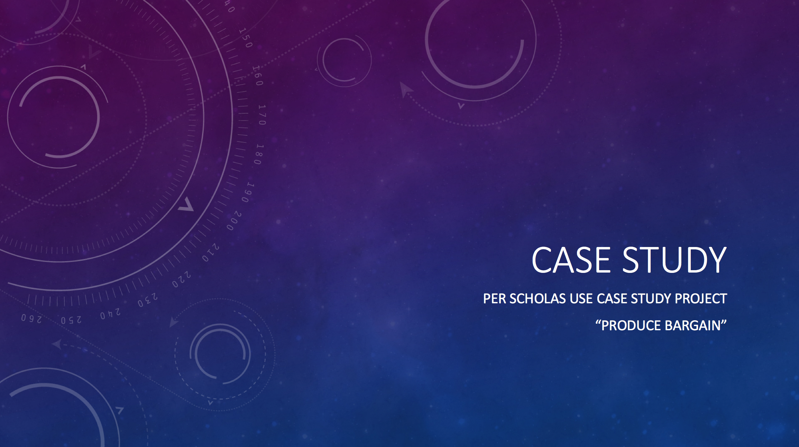

## User Stories and Wireframes
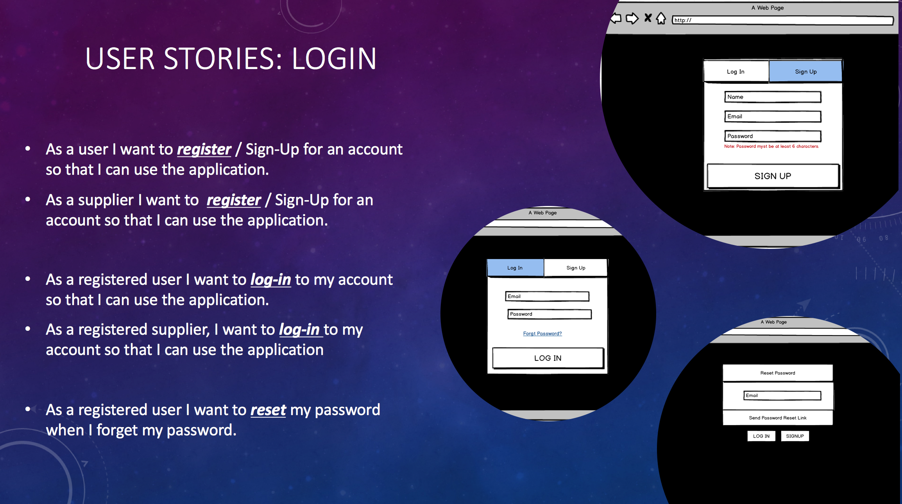
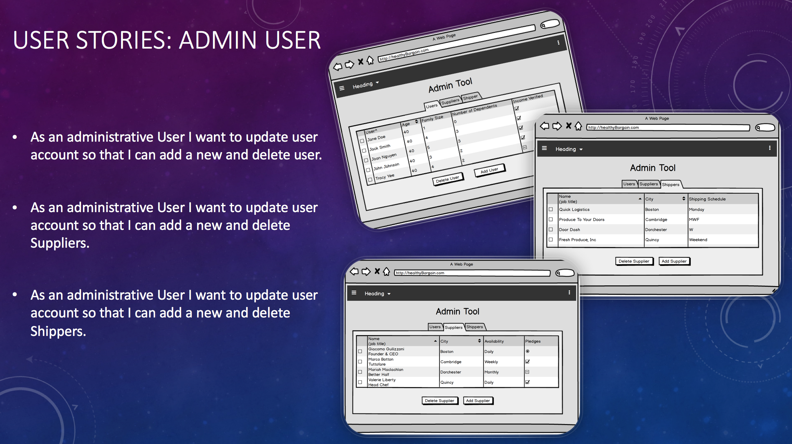
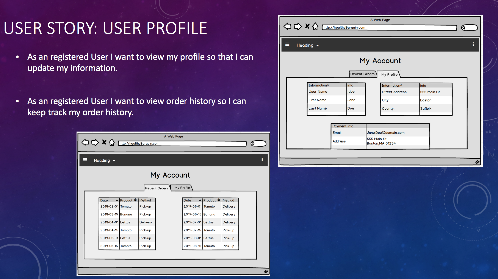
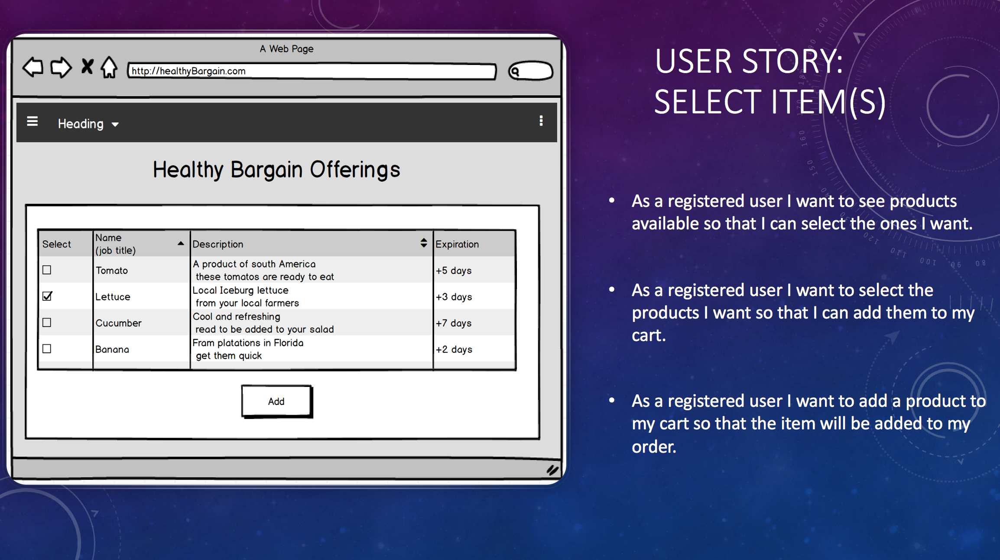

## Application Architecture
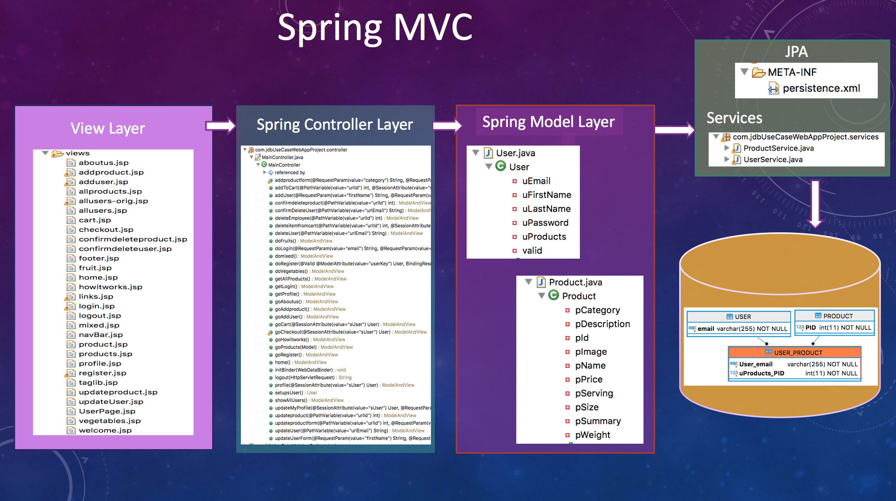

## Data
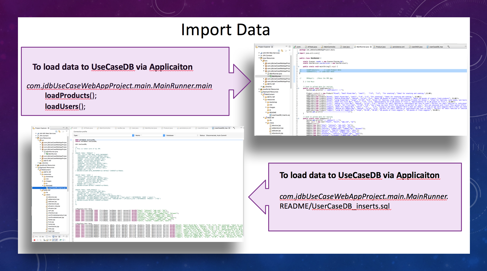
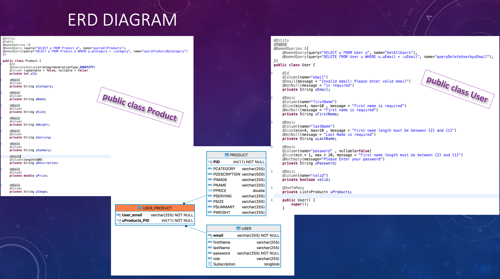

## User Experience
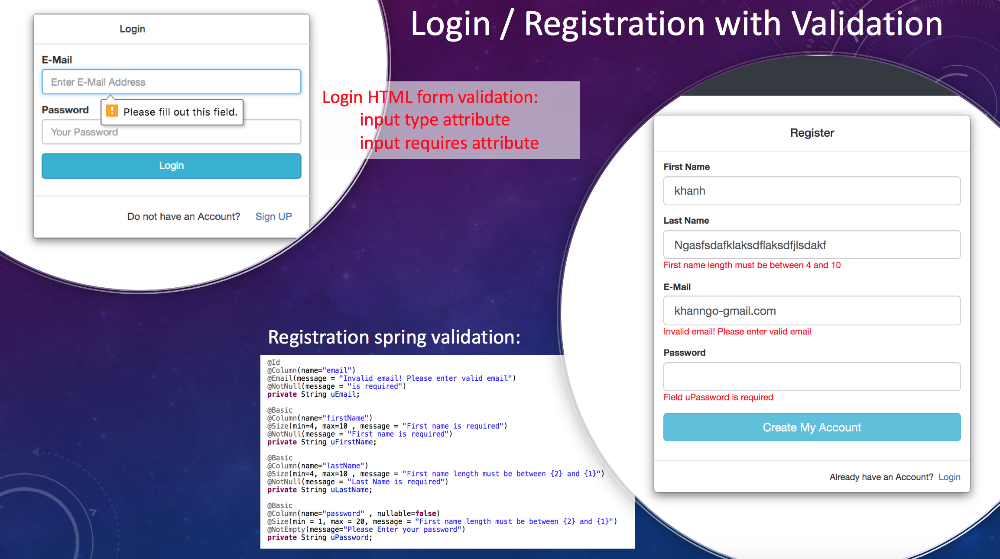
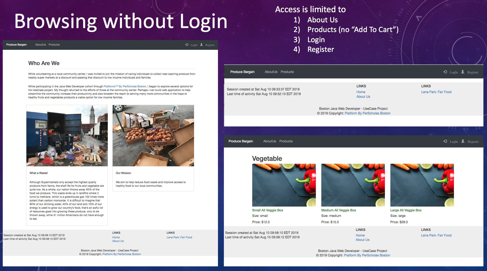
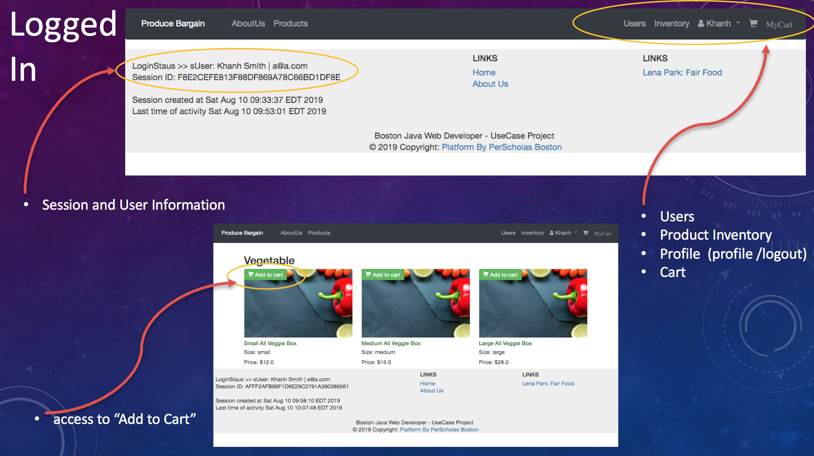
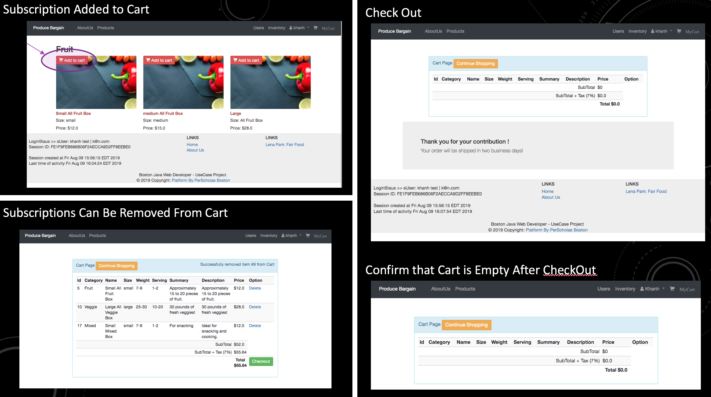

## Testing 
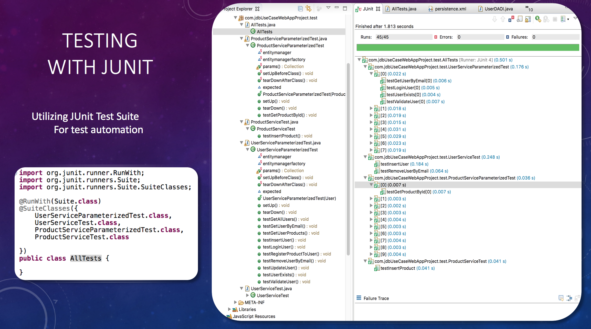

## Progress
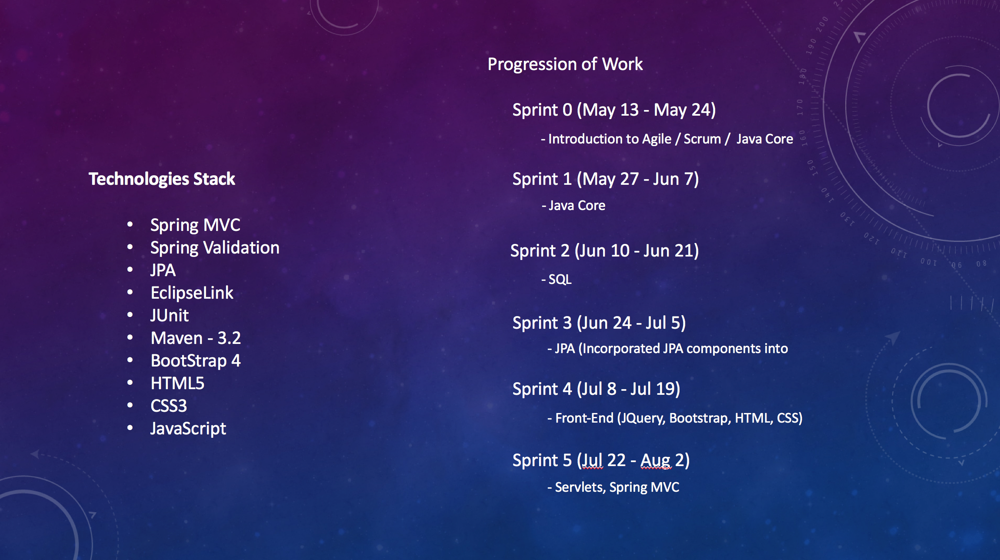

